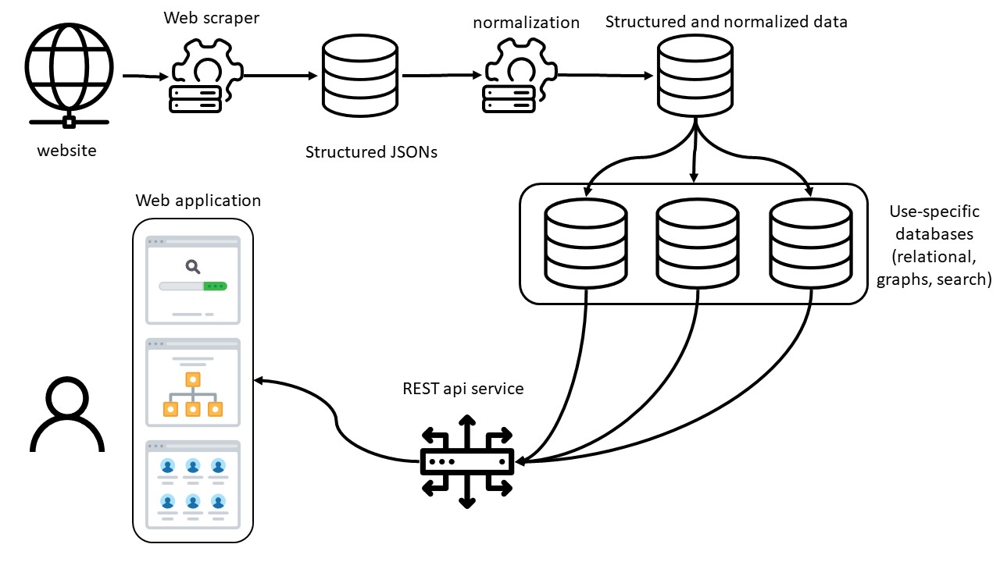

# Spiders Web
This porject is part of the [open knowledge workshop](https://www.hasadna.org.il/).

## What?
This system provides interface for gathering, aggregating and analyzing publicly available data about Israeli publicly traded and state-owned companies and people in key positions in these companies (major shareholders, board members, CEOs, CFOs, etc...).

## Why?
We beleive that transparency enables building a stringer ommunity. This tool can serve valuble insights journalists, regulators, entrepeneurs and any concerned citizen that wish to explore relations in the Israeli corporate realm and tell a story backed by facts.

## How?
1. sign in
2. ask a question
3. ?
4. profit💸

## Table of Contents
1. [Deployment](./docs/DEPLOYMENT.md)

## Project Structure

	

Icon made by [Pixel](https://www.flaticon.com/authors/pixel-perfect) perfect from www.flaticon.com

## Technologies by service

### Data Pipeline
- **Directory:** [data_pipeline](/data_pipeline)
- **Technologies:**
  - Apache Airflow
- **Deployment:**
	Kubernetes

### Databases
- **Technologies:**
  - Neo4j
  - MySQL
  - MongoDB
  - Elasticsearch
- **Deployment:**
	Kubernetes
	
### Rest API
- **Directory:** [api_server](/api_server)
- **Technologies:**
  - Express API
- **Deployment:**
	AWS via serverless

### Web Application
- **Directory:** [api_server](/api_server)
- **Technologies:**
  - NextJS
  - React
  - Material-UI
- **Deployment:**
	AWS via serverless
	
### Local Development
Every service has a different local development environment follow.

### Communication
- github issues
- slack

### Testing
Each project has different testing architecture. Follow instructions for contributing for specific service.

### Contributing
If you wish to contribute please follow [guidelines](...)

### License

### Contact
If you used data generated by this software to write a paper, publish an article or anything, please free to attribute us. 

### TODO 
-[ ] development environemnt for researching new transformations
-[ ] 

